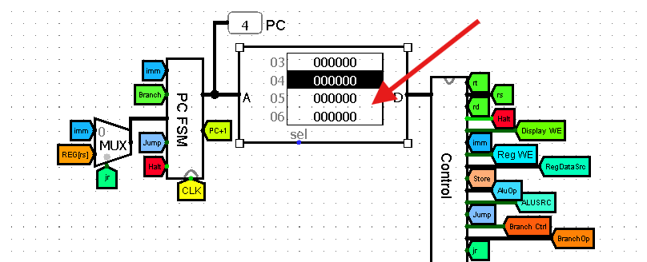
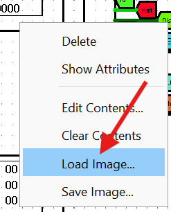

# Logism CPU Schematic
A small single-cycle CPU capable of running real programs (.rom) and outputting numbers. Designed with Logism and implemented with a cpu2247 ISA which is similar to MIPS.

## Table of Contents

- [Description](#description)
- [Installation & Setup](#installation--setup)
    1. [Clone the Repository](#1-clone-the-repository)
    2. [Install Logism](#2-install-logism)
        - [Windows](#windows)
        - [MacOS/Linux](#macoslinux)
- [Usage](#usage)
    - [View the CPU](#view-the-cpu)
    - [Loading Programs](#loading-programs)
    - [Running Programs](#running-programs)
- [License](#license)

## Description

This project was made possible by Logisim. An open-source educational software tool designed for creating and simulating digital logic circuits. It provides a visual interface where users can build and test circuits using basic logic gates, multiplexers, registers, and other digital components.

Included in this repository is a `cpu2247.circ` file containing the schematics for a single-cycle CPU. It was designed to have a 8-bit architecture (some can be 16) with some similarities in its ISA to MIPS. This CPU can actually run real programs and produce output. This repository contains a folder full of roms for you to experiment with. 

Refer to the project structure below:   

```bash
root/.
├── cpu2247.circ              # Main Logisim circuit file  
│  
└── roms/                     # ROM files containing program code  
│   ├── 00_halt.rom           # test HALT operation  
│   ├── 01_li_put.rom         # test 'li' and 'put' instructions  
│   ├── 02_allregs.rom        # test all register operations  
│   ├── 03_mov.rom            # test 'mov' instruction  
│   ├── 04_alu_basic.rom      # test basic ALU operations  
│   ├── 05_alu_imm.rom        # test ALU immediate operations  
│   ├── 06_ld_st.rom          # test load/store operations  
│   ├── 07_ld_st_2.rom        # test load/store operations, second part  
│   ├── 08_j.rom              # test 'j' instruction (jump)  
│   ├── 09_jr.rom             # test 'jr' instruction (jump register)  
│   ├── 10_jal.rom            # test 'jal' instruction (jump and link)  
│   ├── 11_jal_jr.rom         # test 'jal' and 'jr' instructions combined  
│   ├── 12_blt.rom            # test 'blt' instruction (branch on less than)  
│   ├── 13_bge.rom            # test 'bge' instruction (branch on greater or equal)  
│   ├── 14_beq.rom            # test 'beq' instruction (branch on equal)  
│   ├── 15_bne.rom            # test 'bne' instruction (branch on not equal)  
│   ├── 16_sign_cmp.rom       # program for signed comparison  
│   ├── 17_primes.rom         # program for prime number calculation  
│   └── 18_sum.rom            # program for summing numbers  
```

## Installation & Setup

### 1. Clone the Repository

If you haven't already, clone the repository:
```bash
git clone https://github.com/prebish/cpu2247-schematic.git
```

### 2. Install Logism
  
The origin repository for Logism can be found [here](https://github.com/logisim-evolution/logisim-evolution). However, for this project I will be using a fork created by [Jarrett Billingsley](https://github.com/JarrettBillingsley).  

Follow the instructions based on your OS:

#### **Windows**

1. Download the `.exe` for Logism from the fork of the original repo: [Logisim_2241_1103-2.7.2412.exe](https://github.com/JarrettBillingsley/logisim/raw/master/download/Logisim_2241_1103-2.7.2412.exe)  
2. Double-click the .exe file to run
3. (Optional) MD5 Hash: `acd6c6991cd8906dd158f218892c4e60`

#### **MacOS/Linux**

1. Make sure you have Java 11 or later installed. You can find what you need on the [Offical Oracle Downloads page](https://www.oracle.com/java/technologies/downloads/).  
2. Download the `.jar` file for Logism from the fork of the original repo: [Logisim_2241_1103.jar](https://github.com/JarrettBillingsley/logisim/raw/master/download/Logisim_2241_1103.jar)
3. You can run it by using the JVM like this: ```java -jar <jarfile>```  
4. (Optional) MD5 Hash: `f91a3fdefb80988fff393b16dd737d5b`


## Usage
If you're already familiar with Logism, you can continue to [Loading Images](#loading-images)

### View the CPU
Open the `.circ` file in Logism to view the components of the CPU.  

1. Go to **File > Open** in Logism, of course.
2. Navigate to the `./logism-cpu-schematic/` directory and select `cpu2247.circ`.

### Loading Programs
1. Right-Click on the **ROM Component**.  
      
  
2. Click **Load Image**.  
    

3. Navigate to `logism-cpu-schematic/roms/` and select a `.rom` file.

### Running Programs
To run the program you loaded, you must start the clock cycle.

1. Go to **Simulate** at the top of Logism.  
2. Click **Ticks Enabled**.  
    You can select this again to make the clock stop.
3. Go to **Simulate > Tick Frequency**  
    Now you can select any frequency (greater than 4Hz)

**TIP:** you can clear everything by selecting **Simulate > Reset Simulation**

## License
This project is licensed under the **MIT License** - see the `LICENSE` file for details.
